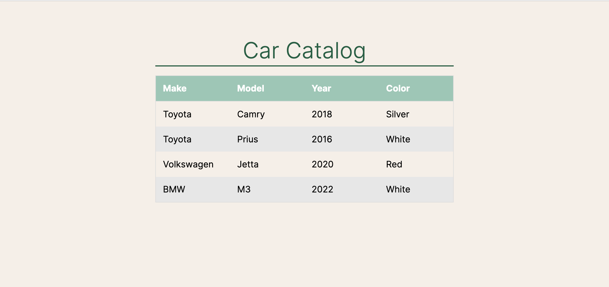

# Car Catalog

## Preview



## Development

### System Requirements

- Node.js 10 or higher
- NPM 6 or higher
- PostgreSQL 15 or higher

### Getting Started

1. Clone the repository.

    ```shell
    git clone https://github.com/tghaffari/carCatalog
    cd carCatalog
    ```

3. Install all dependencies with NPM.

    ```shell
    npm install
    ```

4. Make a copy of .env.example named .env and set your database url.

    ```shell
    cp .env.example .env
    ```

5. Start PostgreSQL

    ```shell
    sudo service postgresql start
    ```

6. Create a new database with PostgreSQL.

   ```shell
    createdb carCatalog
    ```

7. Import the database to PostgreSQL

    ```shell
    npm run db:import
    ```

8. Start the project. Once started you can view the application by opening http://localhost:3000 in your browser.

    ```shell
    npm run dev
    ```
